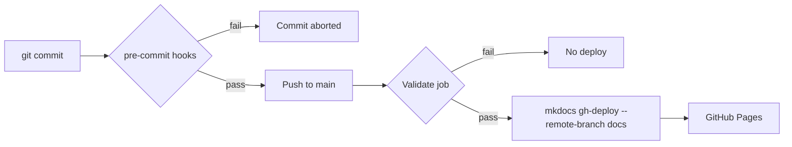

# Validation checks

Every commit is screened by [pre-commit](https://pre-commit.com). The same hooks run
again in GitHub Actions, and the docs site is only deployed if they all pass.

## Install the hooks

```bash
source .venv/bin/activate
pip install pre-commit
pre-commit install
```

From then on, `git commit` runs the checks against your staged files. To check the
whole repository at once:

```bash
pre-commit run --all-files
```

## What runs

| Hook | Scope | Purpose |
| --- | --- | --- |
| `trailing-whitespace` | all files | Strips trailing spaces that create noisy diffs |
| `end-of-file-fixer` | all files | Guarantees a single trailing newline |
| `mixed-line-ending` | all files | Normalises everything to LF |
| `check-yaml` | `*.yml`, `*.yaml` | Parses `mkdocs.yml` and the workflows |
| `check-merge-conflict` | all files | Blocks `<<<<<<<` markers |
| `check-added-large-files` | all files | Rejects anything over 512 KB |
| `markdownlint-cli2` | `docs/**/*.md` | Enforces consistent Markdown structure |
| `codespell` | `docs/**/*.md` | Finds common misspellings in prose |
| `mkdocs build --strict` | `docs/`, `mkdocs.yml` | Fails on broken links, bad nav, unknown config |

!!! tip "Bypassing is a last resort"
    `git commit --no-verify` skips the hooks locally, but CI still runs them and the
    deploy job will refuse to publish. Fix the finding instead.

## The pipeline



See [Failure examples](failures.md) for what each check looks like when it trips.

## The commit log

Every commit gets its own generated page under [Commit log](commits/index.md),
showing the full message, hash, parents, files changed, and the validation result
recorded at commit time.

Two pieces make this work:

| Piece | Role |
| --- | --- |
| `scripts/record_validation.py` | Runs as a `post-commit` hook. Replays the checks against the files the commit touched and appends the per-hook result to `validation-log.jsonl`. |
| `scripts/gen_commit_docs.py` | Reads `git log` plus the ledger and writes `docs/commits/*.md` during every build. |

The generated pages are gitignored — they are rebuilt from git history each time, so
there is no generated Markdown to review or merge.

Install both hook types to get commit records:

```bash
pre-commit install --hook-type pre-commit --hook-type post-commit
```

!!! note "The ledger lags by one commit"
    A record can only be written *after* its commit exists, so the entry for commit
    `N` is committed as part of commit `N+1`. The newest commit therefore shows
    **No record** until you commit again.

Because the checks are replayed after the fact, a commit forced through with
`--no-verify` is still recorded — it simply lands in the log marked **Failed**.
